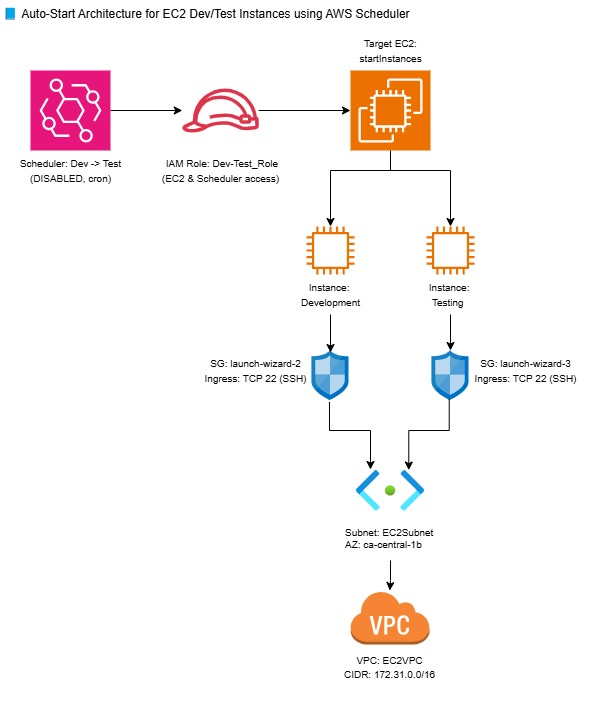

# EC2 Dev/Test Auto-Start Architecture using AWS Scheduler

This project provides an automated solution to **start EC2 instances for Development and Testing environments** on a schedule using **AWS EventBridge Scheduler**. The architecture is defined using a CloudFormation YAML template and includes a complete diagram for visual clarity.

---

## Project Contents

| File                             | Description                                                                     |
|----------------------------------|---------------------------------------------------------------------------------|
| `ec2_dev_test.yaml`              | CloudFormation template defining EC2, Scheduler, VPC, IAM, Subnet, and more.    |
| `ec2_scheduler_architecture.png` | Architecture diagram visually showing the full AWS resource flow.               |


---

## Features

- **AWS EventBridge Scheduler** with CRON to auto-start instances
- **Two EC2 Instances**: One for Development and one for Testing
- **IAM Role** with access to EC2 and Scheduler actions
- **Separate Security Groups** allowing SSH on port 22
- **Subnet and VPC** defined for proper networking
- **Persistent Volumes and Network Interfaces**
- **CloudFormation template for repeatable, consistent setup**

---

## Architecture Diagram



**Flow:**

1. AWS Scheduler is configured with a CRON expression (disabled by default for safety).
2. It assumes the IAM role with EC2 and Scheduler permissions.
3. The Scheduler targets and starts both EC2 instances (`Development` and `Testing`).
4. Each instance is configured with its own Security Group and connected to the same Subnet within a defined VPC.

---

## Technologies Used

- **AWS CloudFormation (IaC)**
- **Amazon EC2**
- **Amazon EventBridge Scheduler**
- **IAM Roles & Policies**
- **VPC, Subnet, and Security Groups**
- **YAML**

---

## Scheduler Configuration (in YAML)

```yaml
ScheduleExpression: cron(55 7 ? 5 Monday 2025)
StartDate: 2025-05-01T11:55:00.000Z
EndDate: 2025-05-31T12:05:00.000Z
State: DISABLED

Deployment Instructions
aws cloudformation create-stack \
  --stack-name ec2-devtest-scheduler \
  --template-body file://ec2_dev_test.yaml \
  --capabilities CAPABILITY_NAMED_IAM

Delete Stack: 
aws cloudformation delete-stack --stack-name ec2-devtest-scheduler
